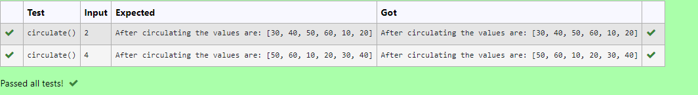

# Circulate-the-values-of-N-variables
## Aim:
To write a python program to circulate the n variables using function concept
## Equipment’s required:
PC
Anaconda - Python 3.7
## Algorithm:  
### Step 1: 
Get the value from the user for the number of rotation
### Step 2: 
Using the slicing concept rotate the list 
## Program:
```
#Program to circulate N values.
#Developed by: Nithishkumar P
#RegisterNumber: 21005889
def circulate():
    l=[10,20,30,40,50,60]
    n=int(input())
    a=l[n:]+l[:n]
    print("After circulating the values are:",a)
```

## Output:


## Result:
Thus circulating the values of N variables are successfully executed
